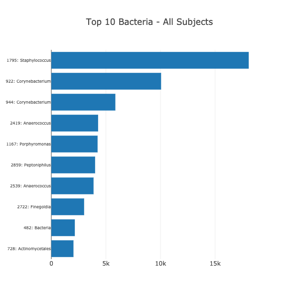
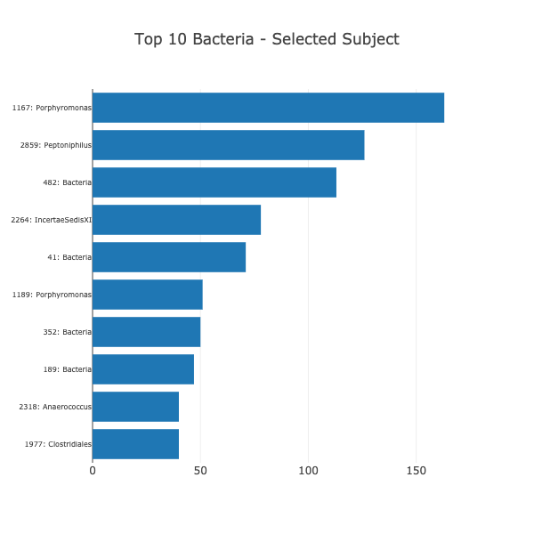
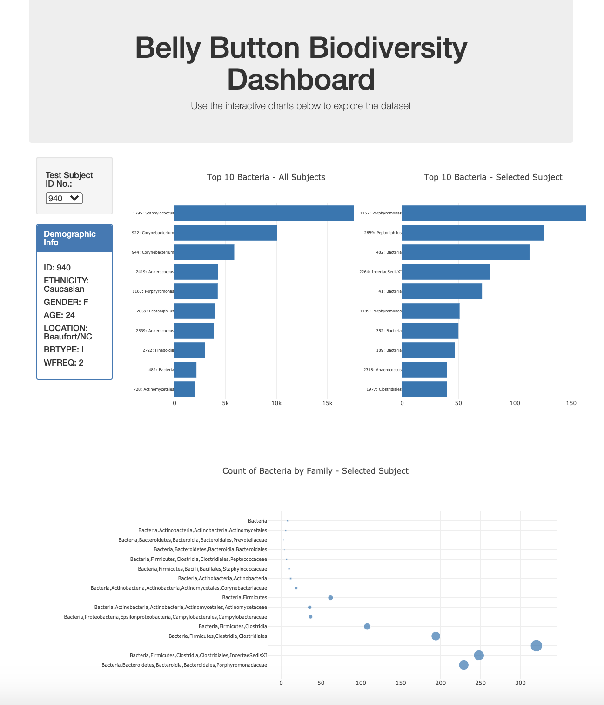

# Plot.ly-Homework---Belly-Button-Biodiversity

Members:

>**Jesus Jasso**

For this exercise,I had to build an interactive dashboard to explore the [Belly Button Biodiversity dataset](http://robdunnlab.com/projects/belly-button-biodiversity/), which catalogs the microbes that colonize human navels.

The dataset reveals that a small handful of microbial species (also called operational taxonomic units, or OTUs, in the study) were present in more than 70% of people, while the rest were relatively rare.

## Step 1: Plotly

1. Use the D3 library to read in `samples.json`.

2. Consider a specific individual/person (test subject ID 940) 

2. Create a horizontal bar chart with a dropdown menu to display the top 10 OTUs (microbial species) found in the test subject 940.

* Use `sample_values` as the values for the bar chart.

* Use `<otu_id>: <genus>` as the labels for the bar chart. The otu_labels are taxonomies that follow the taxonomic rank - `Kingdom (or Domain in the case of Archaea); Phylum; Subphylum; Order; Family; Genus`  

* Use `otu_labels` as the hovertext for the chart.

2. Create another horizontal bar chart to display the top 10 OTUs (microbial species) found in all individuals. (Note that this chart will not be specific to the selected test subject)

* Aggregate (sum) the sample_values across all individuals by OTU ID.

* Use `(aggregated) sample_values` as the values for the bar chart.

* Use `<otu_id>: <genus>` as the labels for the bar chart. The otu_labels are taxonomies that follow the taxonomic rank - `Kingdom (or Domain in the case of Archaea); Phylum; Subphylum; Order; Family; Genus`  

* Use `otu_labels` as the hovertext for the chart.

3. Create a bubble chart that displays the count of microbes by family for the test subject 940.

* Note that `family` here is the family of the microbe and can be found by extracting the `Kingdom (or Domain in the case of Archaea); Phylum; Subphylum; Order; Family` portion of the `otu_label` and leaving out the `Genus`. 
For eg. the label of the OTU ID 1 is `Archaea;Euryarchaeota;Halobacteria;Halobacteriales;Halobacteriaceae;Halococcus`. Its `family` will be `Archaea;Euryarchaeota;Halobacteria;Halobacteriales;Halobacteriaceae`

* Aggregate (sum) the sample_values across the selected individual by `family`.

* Use `family` for the y values.

* Use `(aggregated) sample_values` for the x values.

* Use `(aggregated) sample_values` for the marker size (area).

* Use `family` for the text values.

4. Display the sample metadata, i.e., an individual's demographic information.

5. Display each key-value pair from the metadata JSON object somewhere on the page.

6. Update the bar chart and bubble chart specific to teh test subject every time a new test subject is selected using the dropdown prov

###Visualization Inspiration

